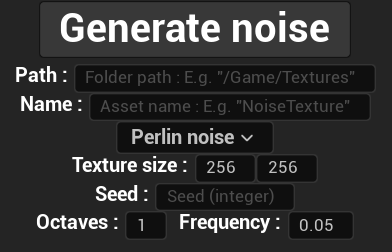
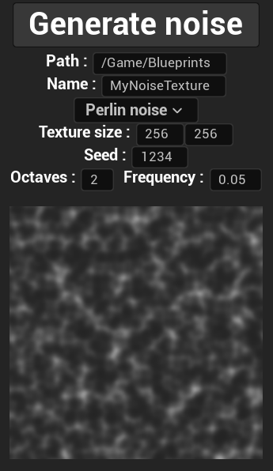
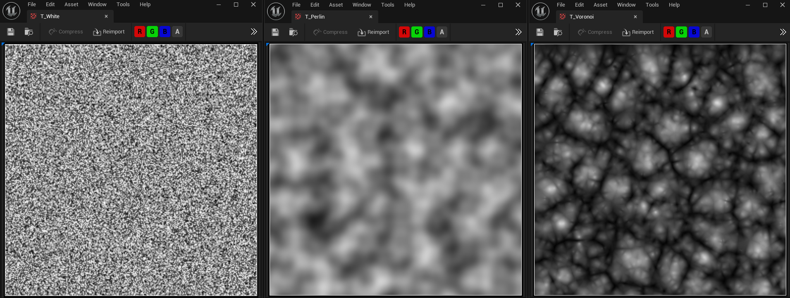

# Noise Generator Utility

This project implements a Blueprint Function Library class, `UNoiseGenerator`, to generate procedural noise textures. It supports multiple noise types, such as **White Noise**, **Perlin Noise**, and **Voronoi Noise**, with customizable parameters. The generated noise is stored as `UTexture2D` assets in Unreal Engine.

## Supported Noise Types

1. **White Noise**:
   - Random values for each pixel.
2. **Perlin Noise**:
   - Gradient-based noise with octave and frequency control.
3. **Voronoi Noise**:
   - Generates a cell-like structure, influenced by randomly distributed nuclei.

## Parameters

The noise generator uses the following parameters for customization:

- **Path**: The folder where the generated texture will be stored.
- **Name**: The name of the generated asset.
- **Noise Type**: The type of noise (`WhiteNoise`, `PerlinNoise`, or `VoronoiNoise`).
- **Texture Size**: Dimensions of the generated texture.
- **Seed**: Used for randomization.
- **Octaves**: Number of noise layers blended for detailed patterns.
- **Frequency**: Determines the scale of features in the noise.

## How It Works

1. **Input Parameters**: 
   - The user specifies the input parameters using the Editor Utility Widget.
2. **Noise Generation**:
   - Depending on the selected noise type, the appropriate algorithm (e.g., Perlin, Voronoi) generates the texture data.
3. **Texture Creation**:
   - A `UTexture2D` asset is created in Unreal Engine and populated with the generated noise data.
4. **Asset Saving**:
   - The texture is saved in the specified location in the project.

## Installation

To use this utility in your Unreal Engine project:

1. Include the `UNoiseGenerator` class in your project source files.
2. Set up an editor widget to provide the required input parameters.
3. Use the `CreateNoise` function to generate textures.

## Example Usage

Below is an example of how to call the `CreateNoise` function:

```cpp
UNoiseGenerator* NoiseGen = NewObject<UNoiseGenerator>();
UTexture2D* Texture = NoiseGen->CreateNoise(
    TEXT("/Game/Textures"),
    TEXT("MyNoiseTexture"),
    ENoiseType::PerlinNoise,
    512, // Width
    512, // Height
    12345, // Seed
    4, // Octaves
    0.01f // Frequency
);
```
## Quick Start
1. Generate project files and compile the code.
2. Run the Editor Utility Widget.
3. Fill the required parameters.
4. Generate the noise.

One of each type of noise is provided in *Content/Noise*.

## License
This project is intended for learning purposes and is free for personal and educational use.

## Visualization

The following images show the Editor Utility Widget and different noise textures:





